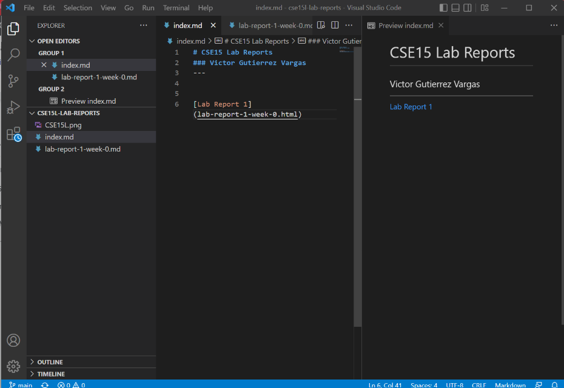
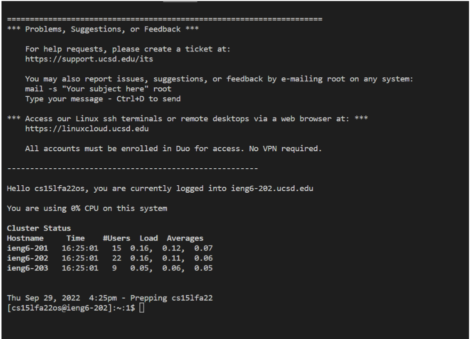
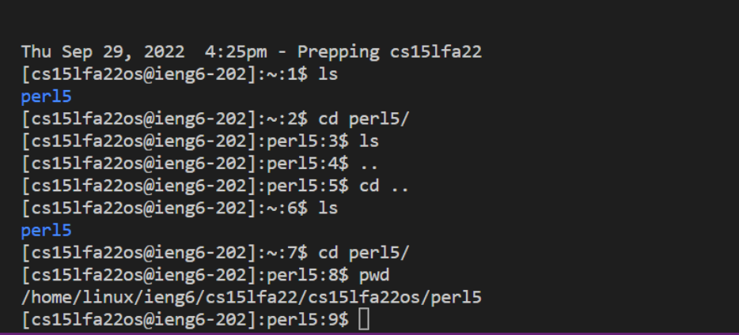
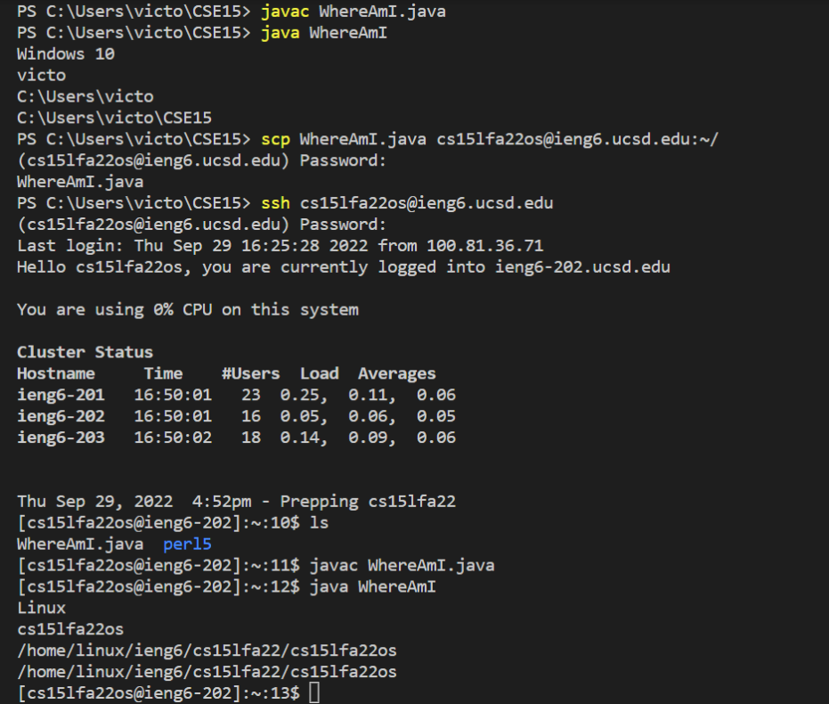
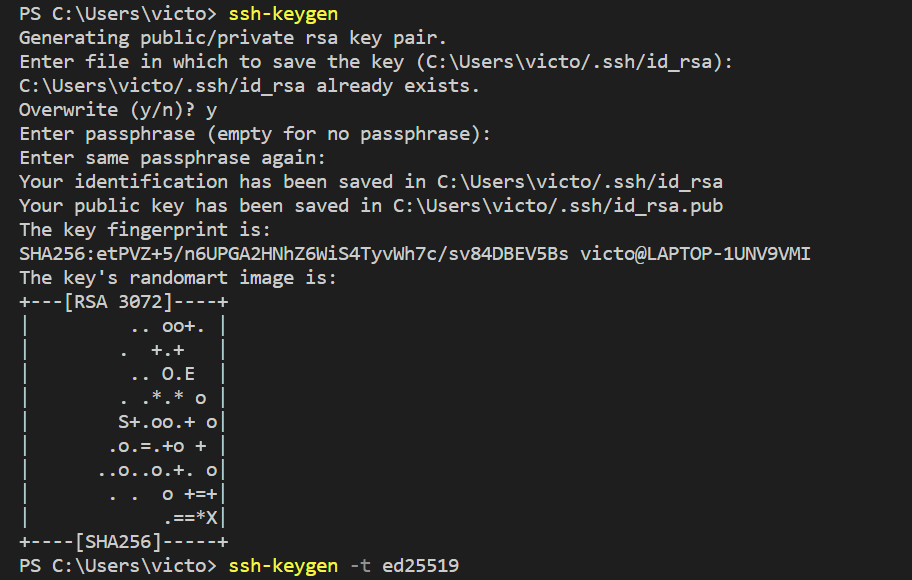
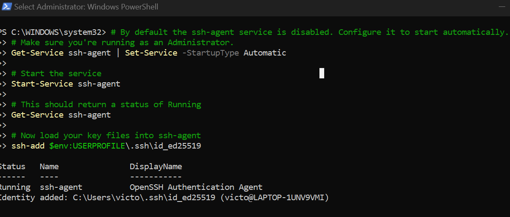
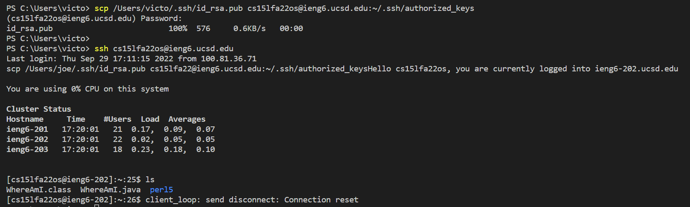

# Week 2 Lab Report

## Victor Gutierrez Vargas 

**September 30, 2022**

---

## *Installing VScode*

* **For the first procedure, go to the [Visual Studio Code Website](https://code.visualstudio.com/), download and install it on your computer.**

*Once finished downloading, open VScode.*

---

## *Remotely Connecting*

* **Open terminal**
  - To open terminal by pressing (Ctrl + Shift + ') or by clicking new terminal
* **Install OpenSSH**
  - [Link to OpenSSH](https://learn.microsoft.com/en-us/windows-server/administration/openssh/openssh_install_firstuse?tabs=gui)
* **Look up the CSE15L account**
  - [Website to account lookup for CSE15](https://sdacs.ucsd.edu/~icc/index.php)
* **Connect to the remote host (ieng6.ucsd.edu server)**
  - To connext to the remote host, you use your account for CSE15L with the new password.

---
## *Trying Some Commands*

* **To get use to the terminal, running couple commands, will help to get adjusted using the terminal**

* **As an example I ran the "pwd" and "cat" or "ls" commands in the terminal**

*Using the “pwd” we are shown the path of the current directory and command “cp” copies a file and “cat” shows you what in the file*

---

## *Moving Files with scp*

* **Open another terminal, make sure to not log in to the "ieng6" but from the client(your computer)**
* **In the clients terminal run the command "scp"**
  - The scp command copies files or directories between a local and a remote system or between two remote systems. 
* **The file you will move to the desired client (in  this case it will beieng6 account)**
  - You can use this command from a remote system or from the local system. 
  * $scp filename(desired location to copy file)*
* **It will ask you for a password**

* **Log back in to the ieng6 with the ssh and in your home directory.** 

* **Using the "ls" command you should see the file that you just moved.**

*"scp" copies the file from your computer and moves the file over to the SSH*

---

## *Setting an SSH Key*

* **On the client computer I ran the "ssh-keygen" command. The command essentially automatic logs you in or let used the "scp" command without constantly typing in a password.**

* **I made sure that I did not add a passphrase for the step and just pressed enter until recieve the randimart immage.**

* **Then copy the the public key to the ".ssh" directory on the computer, using the scp command.**

* **Then, logout the ssh ieng6 server and log back in to make sure that logging into the ieng6 server does not require you to insert a password.**

**For Windows computer only there an extra step using the powershell administrator**
(Run the following commands)

--- 

## *Optimizing Remote Running*

* **Remote running reduced the amount of time it takes to run a file.**
* **For Example: I ran "javac WhereAmI.java; java WhereAmI" in order to compile the code and run it.**
* **The output was the computer and the user that ran the command**

*It is a faster way to run files without the extra step of compliling it first then to run it.*

